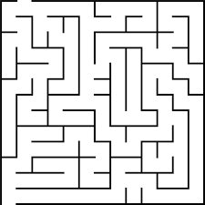
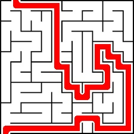

# Real Time Maze Solver
Our Project Aims for solving a maze whenever a user gives an maze image as input.
  

 
<h2>Steps</h2>
- Initially the maze in a frame is to be detected.
- Once the frame is detected, Start & Stops points for the image is calculated by our algorithm.
- Each maze (image) is converted to a numpy array consists of only binary values 0's and 1's. Here zeroes are for blocked ways and 1s are for free path.
- An Algorithm was developed to find the shortest path from start and stop points in a maze (One for a maze in which start ad stop points are mentioned and one for those which are not mentioned).
- Once the path is found, the neighbour points which are near to our result is added to the path if they are unblocked.(This step is optional, it is used to increase the thickness).
  
 
 

## Contributors
- [Saiteja Kura](https://github.com/kurasaiteja)
- [Ritheesh Baradwaj](https://github.com/RitheeshBaradwaj)

### Detailed Solution will be updated soon!!

## Thank you :D
